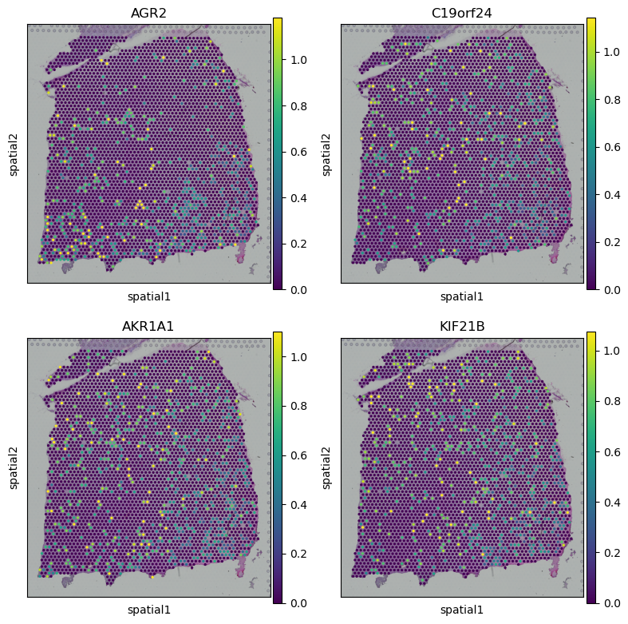
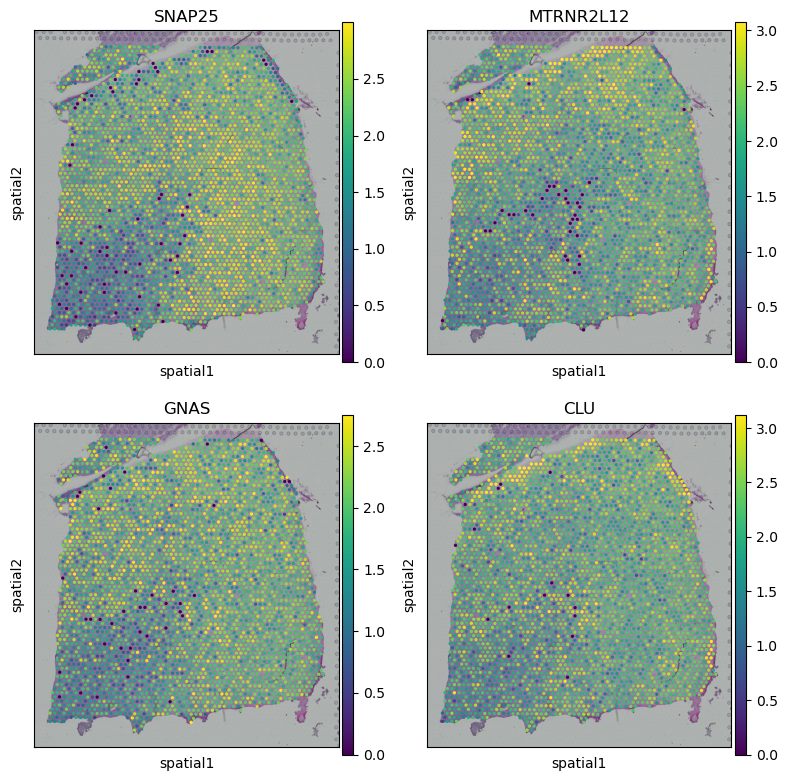

## Step1: Load data
```python
from SIGEL.src.SIGEL_SVG.utils import simu_zinb
from SIGEL.src.SIGEL_SVG.utils import get_svg_score
from SIGEL.src.main.SIGEL import SIGEL
import matplotlib.pyplot as plt
import pandas as pd
import scanpy as sc
import numpy as np
import warnings
warnings.filterwarnings("ignore")
```


```python
## get adata and image data
adata= SIGEL.get_data(sample_id='151676', data_type='adata')
dataset, adata = SIGEL.data_process(adata)
```

    adata2image: 100%|██████████| 18639/18639 [05:25<00:00, 57.27gene/s]

## Step2: Train SIGEL to get SGEs

```python
## train model with pretrained model
y_pred, SGEs, model = SIGEL.train(dataset=dataset, pretrain=False)
```

    use cuda: True
    load pretrained mae from SIGEL/model_pretrained/SIGEL.pkl


    Clustering: 100%|██████████| 30/30 [07:55<00:00, 15.84s/it]

## Step3: Generate SVG score

```python
## generate SVG score
adata.X = adata.X.todense()
svg_score = get_svg_score(SGEs, dataset, adata, model, sim_times=10)
```

    100%|██████████| 10/10 [02:29<00:00, 14.93s/it]

## Step4: Display the result

```python
## obtain spatial variable gene index
ascending_indices = np.argsort(svg_score)
descending_indices = ascending_indices[::-1]
```


```python
## get gene name from adata
gene_name = adata.var.index.values
```


```python
## gene expression whitin high svg score
plot_gene = gene_name[descending_indices[:4]]

fig, axs = plt.subplots(2, 2, figsize=(8, 8))

sc.pl.spatial(adata, img_key="hires", color=plot_gene[0], show=False, ax=axs[0, 0], title=plot_gene[0], vmax='p99')
sc.pl.spatial(adata, img_key="hires", color=plot_gene[1], show=False, ax=axs[0, 1], title=plot_gene[1], vmax='p99')
sc.pl.spatial(adata, img_key="hires", color=plot_gene[2], show=False, ax=axs[1, 0], title=plot_gene[2], vmax='p99')
sc.pl.spatial(adata, img_key="hires", color=plot_gene[3], show=False, ax=axs[1, 1], title=plot_gene[3], vmax='p99')

plt.tight_layout()
plt.show()

```


    

    


```python
## gene expression whitin low svg score
plot_gene = gene_name[ascending_indices[2:6]]

fig, axs = plt.subplots(2, 2, figsize=(8, 8))

sc.pl.spatial(adata, img_key="hires", color=plot_gene[0], show=False, ax=axs[0, 0], title=plot_gene[0], vmax='p99')
sc.pl.spatial(adata, img_key="hires", color=plot_gene[1], show=False, ax=axs[0, 1], title=plot_gene[1], vmax='p99')
sc.pl.spatial(adata, img_key="hires", color=plot_gene[2], show=False, ax=axs[1, 0], title=plot_gene[2], vmax='p99')
sc.pl.spatial(adata, img_key="hires", color=plot_gene[3], show=False, ax=axs[1, 1], title=plot_gene[3], vmax='p99')

plt.tight_layout()
plt.show()

```


    

    

