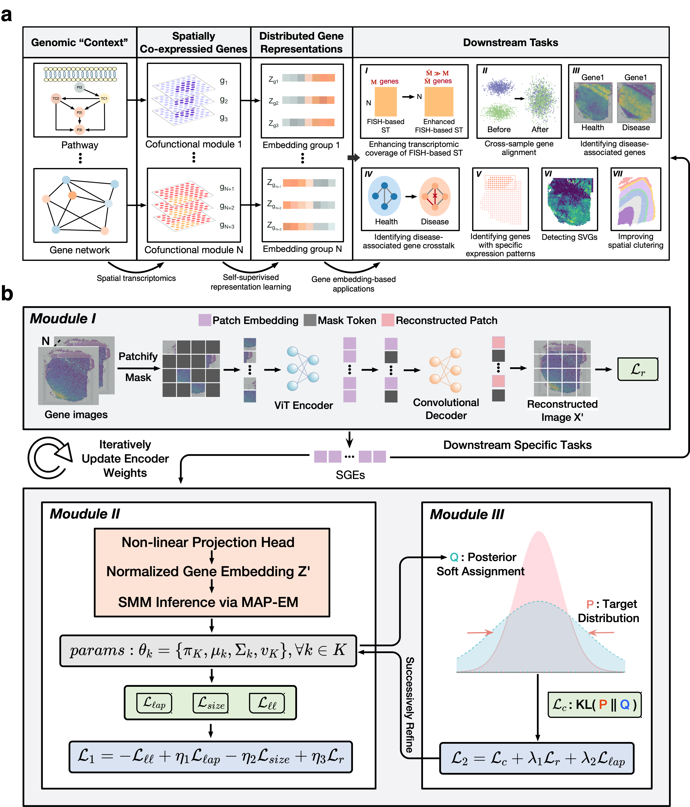
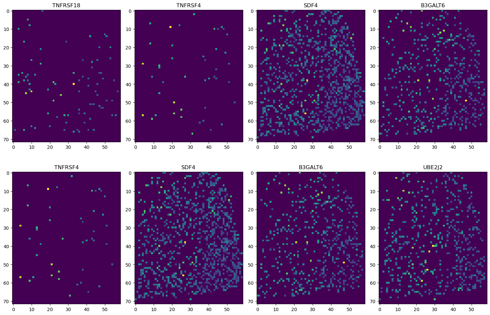
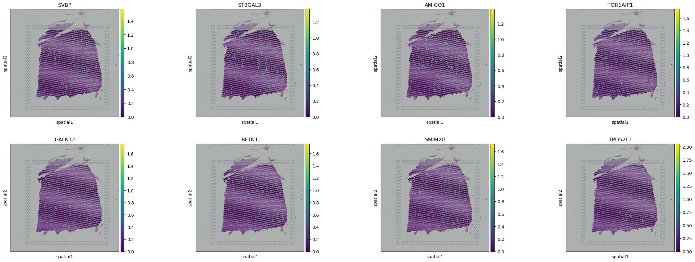
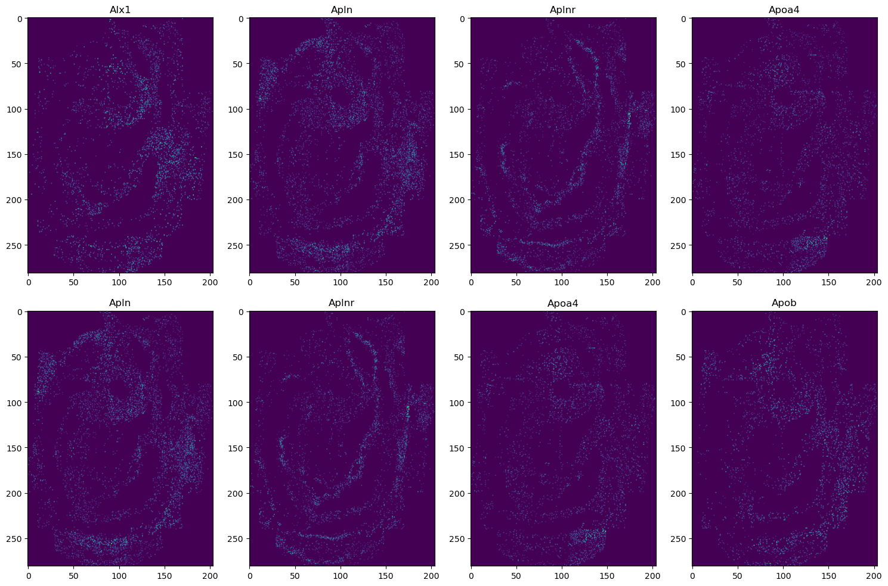
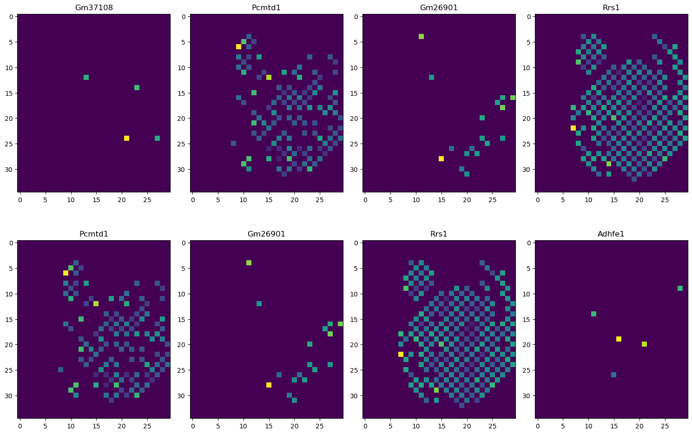
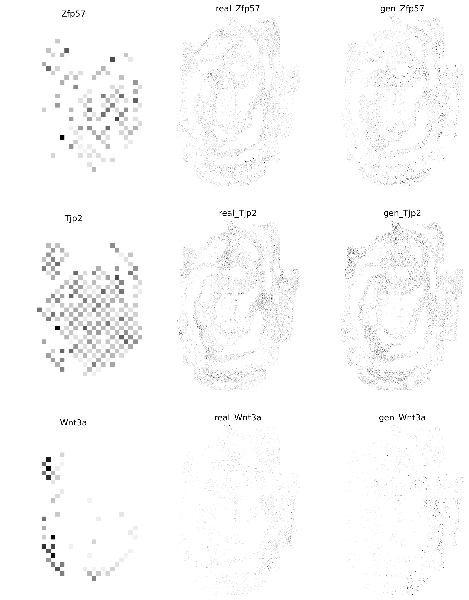
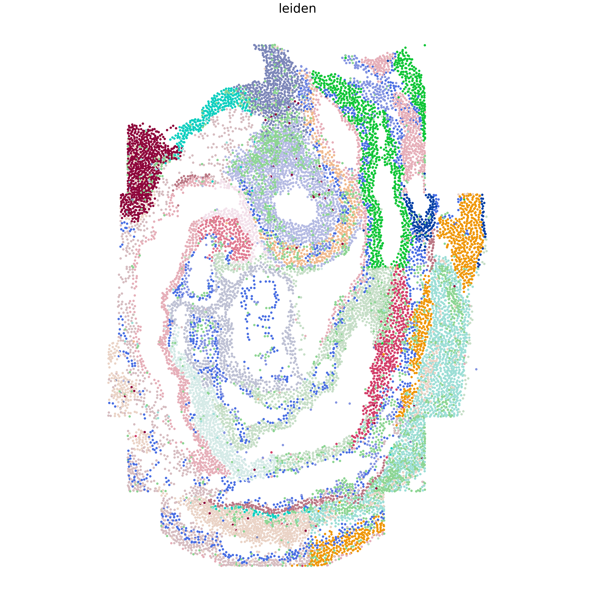
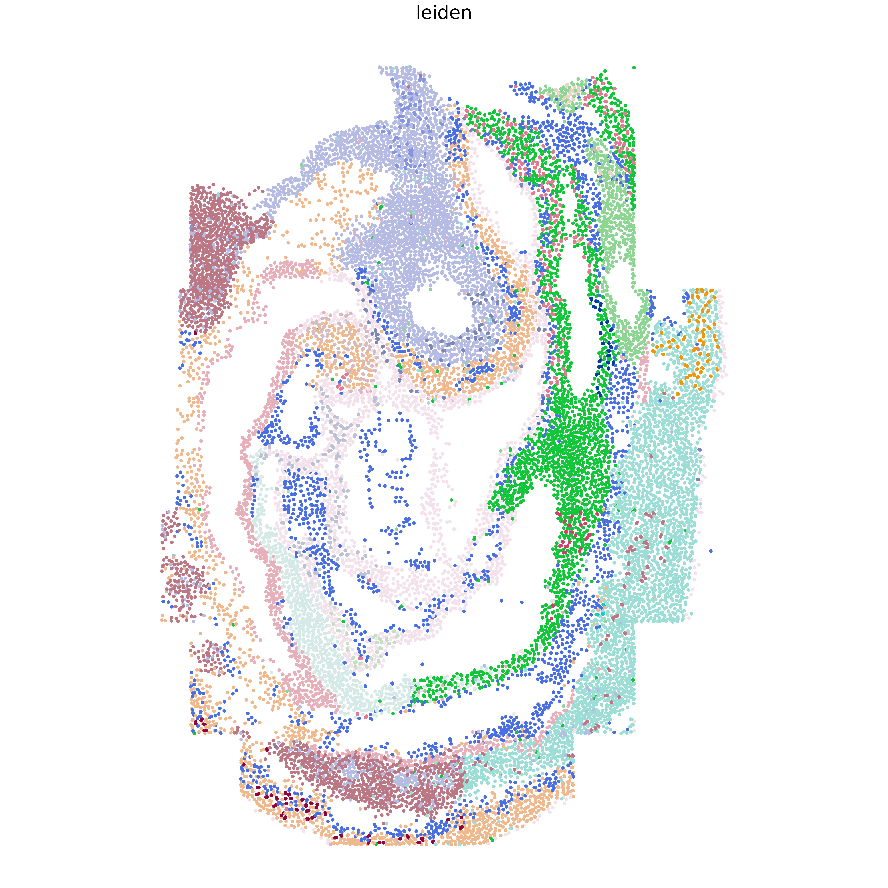

# 0 Welcome to SIGEL
We develop the **S**patially **I**nformed **G**ene **E**mbedding **L**earning (**SIGEL**) that can simultaneously identify spatially co-expressed genes and learn semantically meaningful gene embeddings from SRT data through a pretext task of gene clustering. SIGEL first employs an image encoder to transform the spatial expression maps of genes into gene embeddings modeled by a Student’s t mixture distribution (SMM). Subsequently, a discriminatively boosted gene clustering algorithm is applied on the posterior soft assignments of genes to the mixture components, iteratively adapting the parameters of the encoder and the SMM.

<div style="text-align: center;">
    
</div>


## 0.1 Introduction

The limited exploration into spatial gene co-expression within tissues has been a significant bottleneck in fully harnessing the spatial genomic context for more insightful gene representations. To bridge this gap, we introduce **SIGEL**, a novel few-shot, self-supervised learning model tailored for the genomic field.



As shown in the figure above, **SIGEL** generates semantically meaningful gene Representations (SGRs) by identifying spatial gene co-expression patterns. Cofunctional and enrichment analyses of SGRs endorse their utility as genomic contexts, validated through relational semantics and exploration of gene functional ontology. Three novel SGR-based methods are proposed for enhancing FISH-based spatial transcriptomics, detecting spatially variable genes, and spatial clustering. Extensive real data results affirm the superior performance of these methods, highlighting the utility of SGRs for downstream tasks.

# 1 Preparation

## 1.1 Installation

To use SIGEL, please download code from https://github.com/WLatSunLab/SIGEL or conduct code below:

```bash
git clone https://github.com/WLatSunLab/SIGEL.git
cd SIGEL/
python3 setup.py install
```

## 1.2 Getting Help

For inquiries related to SIGEL's codebase or experimental setup, please feel free to post your questions in the GitHub issues section of the [SIGEL repository](https://github.com/WLatSunLab/SIGEL).

## 1.3 Datasets

You can access a variety of datasets for spatial gene expression analysis:

- **The Slide-seqV2 dataset of Mouse Hippocampus ([ssq-mHippo](https://singlecell.broadinstitute.org/single_cell/study/SCP815/sensitive-spatial-genome-wide-expression-profiling-at-cellular-resolution#study-summary))**
- **The 10x-Visium datasets of Human Dorsolateral Prefrontal Cortex ([10x-hDLPFC](http://spatial.libd.org/spatialLIBD))**
- **The 10x-Visium dataset of Human Breast Cancer ([10x-hBC](https://support.10xgenomics.com/spatial-gene-expression/datasets/1.1.0/V1_Breast_Cancer_Block_A_Section_1))**
- **The 10x-Visium datasets of Human Middle Temporal Gyrus ([10x-hMTG](https://www.ncbi.nlm.nih.gov/geo/query/acc.cgi?acc=GSE220442))**
- **The 10x-Visium dataset of Mouse Embryo ([10x-mEmb](https://www.ncbi.nlm.nih.gov/geo/query/acc.cgi?acc=GSE178636))**
- **The SeqFISH dataset of Mouse Embryo ([sqf-mEmb](https://crukci.shinyapps.io/SpatialMouseAtlas/))**

Example data required for SIGEL is available [here](https://drive.google.com/drive/folders/1C3Gk-HVYp2dQh4id8H68M9p8IWEOIut_?usp=drive_link). Please ensure that these data are properly organized as followes:


```
 . <SIGEL>
        ├── ...
        ├── <data>
        │   ├── 151676_10xvisium.h5ad
        │   ├── DLPFC_matrix_151676.dat
        │   └── <mEmb>
        │       ├── 10x_mEmb_matrix.dat
        │       ├── sqf_mEmb_adata.h5ad
        │       └── qf_mEmb_matrix.dat
        ├── <model_pretrained>
        │   │
        └── ...

```


# 2 Obtain SGRs

In this task, we use 10x-hDLPFC-151676 dataset to generate SGRs.

## 2.1 Data preprocessing

We follow standard preprocessing for ST data using SCANPY, removing mitochondrial and ERCC spike-in genes initially. Genes present in fewer than 10 spots are excluded. Quality control is not applied to spatial spots to maintain data integrity. Gene expression counts are normalized by library size and log-transformed. Afterward, spatial coordinates from ST data are converted into images based on quality control outcomes.
```python
from src.SIGEL.SIGEL import SIGEL
import warnings
warnings.filterwarnings("ignore")

adata= SIGEL.get_data(sample_id='151676', data_type='adata')
dataset, adata = SIGEL.data_process(adata)
gene_name = adata.var.index.values
```

## 2.2 Display gene images
Display the visual effects of 8 genes converted into images using the `plt.imshow()` function.
```python
import matplotlib.pyplot as plt

fig, axs = plt.subplots(2, 3,figsize=(15, 10), dpi=100)

for i in range(2):
    for j in range(3):
        axs[i, j].imshow(dataset[12+i+j])
        axs[i, j].set_title(f'{gene_name[12+i+j]}')

plt.tight_layout()
plt.show()
```


## 2.3 Getting SGRs
```python
SGRs, model = SIGEL.train(dataset, pretrain=True)
```
    use cuda: True
    Pretrain: 100%|██████████| 30/30 [02:56<00:00,  5.87s/it]
    model saved to model_pretrained/SIGEL.pkl.
    load pretrained mae from model_pretrained/SIGEL.pkl
    Clustering: 100%|██████████| 30/30 [07:24<00:00, 14.81s/it]
    torch.Size([16060, 32])

## 2.4 Gene co-expression information
The effects of clustering as an auxiliary task will be demonstrated, and it will be evaluated whether SGRs can capture gene co-expression information.
```bash
import squidpy as sq
adata.var['cluster_id']=label
name = list(adata.var_names[adata.var['cluster_id']==1])
sq.pl.spatial_scatter(adata, color=name[:8])
```


# 3 Imputing missing genes in FISH-based ST to enhance transcriptomic coverage
In this section, We introduce SIGEL-enhanced-transcriptomics-coverage (SIGEL-ETC), a novel SGR-based Generative Adversarial Network (GAN) model. It assumes gene relational semantics are consistent across ST data for the same tissue, allowing it to extrapolate spatial profiles from covered to uncovered genes using comprehensive datasets like 10x Visium. Its effectiveness is demonstrated by reproducing spatial gene profiles from a mouse embryo SeqFISH dataset ([sqf-mEmb](https://crukci.shinyapps.io/SpatialMouseAtlas/)), guided by SGRs from a 10x Visium dataset ([10x-mEmb](https://www.ncbi.nlm.nih.gov/geo/query/acc.cgi?acc=GSE178636)).

## 3.1 Load 10x-/sqf-mEmb
We begin by loading and visualizing SeqFISH and 10x Visium data from mice embryos that share similar health statuses and developmental stages.
```bash
from src.SIGEL_ETC.src.SIGEL_ETC import SIGEL_ETC
adata = SIGEL_ETC.get_data(data='sqf', data_type='adata')
adata, key_m, dataset_m = SIGEL_ETC.data_process(adata)
#key_m, dataset_m = SIGEL_ETC.get_data(data='sqf', data_type='image')
key_v, dataset_v = SIGEL_ETC.get_data(data='10x', data_type='image')
```
- `adata` refers to the sqf-mEmb dataset.
- `key_m` represents the gene names in the sqf-mEmb dataset.
- `dataset_m` denotes the imagified version of the sqf-mEmb dataset.
- `key_v` is the gene name in the 10x-mEmb dataset.
- `dataset_v` refers to the imagified 10x-mEmb dataset.
## 3.2 Display gene images

```bash
import matplotlib.pyplot as plt
fig, axs = plt.subplots(2, 4,figsize=(15, 10), dpi=100)

for i in range(2):
    for j in range(4):
        axs[i, j].imshow(dataset_m[12+i+j])
        axs[i, j].set_title(f'{key_m[12+i+j]}')

plt.tight_layout()
plt.show()
```


```bash
import matplotlib.pyplot as plt
fig, axs = plt.subplots(2, 4,figsize=(15, 10), dpi=100)

for i in range(2):
    for j in range(4):
        axs[i, j].imshow(dataset_v[12+i+j])
        axs[i, j].set_title(f'{key_v[12+i+j]}')

plt.tight_layout()
plt.show()
```


## 3.3 Train SIGEL
We train SIGEL using all genes from the 10x-mEmb dataset.
```python
_, model = SIGEL_ETC.train(dataset_v, pretrain=True)
model = SIGEL_ETC.load_model()
all_gmat_v2m, all_gmat_m2v = SIGEL_ETC.data_filter(key_v, dataset_v, key_m, dataset_m)

```
    use cuda: True
    Pretraining: 100%|██████████| 30/30 [01:11<00:00,  2.37s/it]
    model saved to model_pretrained/SIGEL_ETC.pkl.
    load pretrained mae from model_pretrained/SIGEL_ETC.pkl
    Clustering: 100%|██████████| 10/10 [02:03<00:00, 12.32s/it]
- `model`: Refers to the SIGEL model that has been trained using the imagified data from the 10x-mEmb dataset.
- `all_gamt_v2m`: A dictionary mapping gene names to sqf-mEmb image pairs, derived from intersecting genes between the sqf-mEmb and 10x-mEmb datasets.
- `all_gamt_m2v`: A dictionary mapping gene names to 10x-mEmb image pairs, also derived from intersecting genes between the sqf-mEmb and 10x-mEmb datasets.

## 3.4 Train ETC-GAN
We use 80% of the intersecting genes between the sqf-mEmb and 10x-mEmb datasets as the training set to train SIGEL-ETC.
```bash
ETC_GAN, model, SGRs = SIGEL_ETC.train_ETC(adata, all_gmat_v2m, all_gmat_m2v, model)
```
    100%|██████████| 100/100 [00:52<00:00,  1.91it/s]

## 3.5 Imputating gene expression
We evaluate the SIGEL-ETC on the test set.
```bash
import matplotlib.pyplot as plt
import torch
import numpy as np
gene_imp = SIGEL_ETC.sqf_gen(ETC_GAN, SGRs, adata)

def prepare_and_show_image(ax, tensor_data, title, cmap='Greys', interpolation='nearest'):
    img = torch.tensor(tensor_data)
    img = img.squeeze(0).cpu().detach().numpy()
    ax.imshow(img, cmap=cmap, interpolation=interpolation)
    ax.set_title(title)
    ax.axis('off')

# Initialize plot
fig, axs = plt.subplots(3, 3, figsize=(12, 15), dpi=300)

# Data and indices
key_m = np.array(list(all_gmat_m2v.keys()))
indices = [330, 308, 325]

for row, idx in enumerate(indices):
    # Show real 10x-mEmv
    prepare_and_show_image(axs[row, 0], all_gmat_v2m[key_m[idx]], key_m[idx])

    # Show real sqf-mEmb
    prepare_and_show_image(axs[row, 1], all_gmat_m2v[key_m[idx]], f'real_{key_m[idx]}')

    # Show generated sqf-mEmb
    img_fake = gene_imp[idx]
    img_real = torch.tensor(all_gmat_m2v[key_m[idx]]).squeeze(0).cpu().detach().numpy()
    prepare_and_show_image(axs[row, 2], img_fake, f'gen_{key_m[idx]}')

plt.show()
```


## 3.6 Enhanced spatial clustering
```bash
import squidpy as sq
from src.SIGEL_ETC.src.utils import sequential_gen
dataset_m_660, key_m_660 = sequential_gen(model, ETC_GAN, all_gmat_v2m, all_gmat_m2v)
```
    Shape of the non-overlapping gene set: (16569, 35, 30)
    Shape of SGRs: torch.Size([16569, 64])
    The first imputation finished, get 110 new genes
    The second imputation finished, get 220 new genes
    The third imputation finished, get 330 new genes

## 3.7 Display ground truth
```bash
sq.pl.spatial_scatter(
    adata, color="celltype_mapped_refined", shape=None, figsize=(5, 10), dpi=500, frameon=False, legend_loc=None, save = 'grouns_truth.png', title=None
)
```
 


## 3.8 Display origin leigen result
```bash
from src.SIGEL_ETC.src.utils import ari_evalution
adata = adata[:,list(all_gmat_m2v.keys())]
ari_evalution(adata)
```
    Iteration 0: Resolution 0.55 -> 20 clusters
    Iteration 1: Resolution 0.775 -> 22 clusters
    ARI: 0.3612215326878697
    WARNING: Please specify a valid `library_id` or set it permanently in `adata.uns['spatial']`
 

## 3.9 Display enhanced leigen result
```bash
X_imp = np.zeros([adata.X.shape[0], len(dataset_m_660)])
for i in range(X_imp.shape[1]):
    X_imp[:, i] = dataset_m_660[i][adata.obs['array_y'], adata.obs['array_x']]
print(X_imp.shape)
```

```bash
import pandas as pd
import anndata as ad
n_obs = X_imp.shape[1]
var_names = key_m_660[:n_obs]
var = pd.DataFrame(index=var_names)
adata_imp = ad.AnnData(X_imp, obs=adata.obs, var=var, obsm = adata.obsm, uns = adata.uns)
```

```bash
ari_evalution(adata_imp)
```
    Iteration 0: Resolution 0.55 -> 41 clusters
    Iteration 1: Resolution 0.325 -> 31 clusters
    Iteration 2: Resolution 0.21250000000000002 -> 22 clusters
    ARI: 0.4421413788706413
    WARNING: Please specify a valid `library_id` or set it permanently in `adata.uns['spatial']`
 

**Everything else is prepared and ready for deployment. If you have any other needs, please directly contact Wenlin Li at the email: zipging@gmail.com.**
