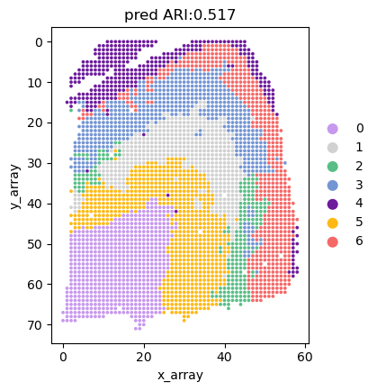

# SpaCEX-SC
## Step1: Load data
```python
from sklearn.metrics.cluster import normalized_mutual_info_score
from collections import OrderedDict
from sklearn.metrics import adjusted_rand_score
from SpaCEX.src.SpaCEX_SVG.utils import simu_zinb
from SpaCEX.src.SpaCEX_SVG.utils import get_svg_score
from SpaCEX.src.SpaCEX_SC.SpaCEX_SC import SpaCEX_SC
from SpaCEX.src.main.SpaCEX import SpaCEX
import matplotlib.pyplot as plt
import pandas as pd
import scanpy as sc
import numpy as np
import warnings
warnings.filterwarnings("ignore")
```


```python
## get adata and image data
adata= SpaCEX.get_data(sample_id='151676', data_type='adata')
dataset, adata = SpaCEX.data_process(adata)
```

    adata2image: 100%|██████████| 18639/18639 [05:27<00:00, 56.85gene/s]


## Step2: Generate SVG score by SpaCEX-SVG
```python
## train model with pretrained model
y_pred, SGEs, model = SpaCEX.train(dataset=dataset, pretrain=False)
```

    use cuda: True
    load pretrained mae from SpaCEX/model_pretrained/SpaCEX.pkl


    Clustering: 100%|██████████| 30/30 [07:12<00:00, 14.41s/it]


```python
## generate SVG score
adata.X = adata.X.todense()
svg_score = get_svg_score(SGEs, dataset, adata, model, sim_times=10)
```

    100%|██████████| 10/10 [02:27<00:00, 14.76s/it]

## Stpe3: Carry out SpaCEX-SC

```python
## get original data
adata= SpaCEX.get_data(sample_id='151676', data_type='adata')
```


```python
## select genes
new_samples_indices = SpaCEX_SC.gene_select(cluster_labels, svg_score, selection_percentage=0.5)
```

```markdown
select 9263 genes
```


```python
## spatial clustering
adata = SpaCEX_SC.spatial_clustering(adata, new_samples_indices, n_clusters=7)
```

    Calculateing adj matrix using xy only...
    Run 1: l [0.01, 1000], p [0.0, 3421.9987256815807]
    Run 2: l [0.01, 500.005], p [0.0, 3416.00732421875]
    Run 3: l [0.01, 250.0075], p [0.0, 3392.22265625]
    Run 4: l [0.01, 125.00874999999999], p [0.0, 3299.90869140625]
    Run 5: l [0.01, 62.509375], p [0.0, 2971.17138671875]
    Run 6: l [0.01, 31.2596875], p [0.0, 2097.834228515625]
    Run 7: l [0.01, 15.63484375], p [0.0, 945.4818725585938]
    Run 8: l [0.01, 7.822421875], p [0.0, 304.0054626464844]
    Run 9: l [0.01, 3.9162109375], p [0.0, 84.49016571044922]
    Run 10: l [0.01, 1.9631054687499998], p [0.0, 21.678667068481445]
    Run 11: l [0.01, 0.9865527343749999], p [0.0, 4.903018474578857]
    Run 12: l [0.01, 0.49827636718749996], p [0.0, 0.5869753360748291]
    Run 13: l [0.25413818359374996, 0.49827636718749996], p [0.0016840696334838867, 0.5869753360748291]
    Run 14: l [0.37620727539062493, 0.49827636718749996], p [0.11651778221130371, 0.5869753360748291]
    Run 15: l [0.4372418212890624, 0.49827636718749996], p [0.304052472114563, 0.5869753360748291]
    Run 16: l [0.4677590942382812, 0.49827636718749996], p [0.43444645404815674, 0.5869753360748291]
    recommended l =  0.48301773071289056
    Start at res =  0.7 step =  0.1
    Initializing cluster centers with louvain, resolution =  0.7


    2023-12-19 14:10:56.114599: I tensorflow/core/util/util.cc:169] oneDNN custom operations are on. You may see slightly different numerical results due to floating-point round-off errors from different computation orders. To turn them off, set the environment variable `TF_ENABLE_ONEDNN_OPTS=0`.


    Epoch  0
    Epoch  10
    Res =  0.7 Num of clusters =  7
    recommended res =  0.7
    Initializing cluster centers with louvain, resolution =  0.7
    Epoch  0
    Epoch  10
    Epoch  20
    Epoch  30
    Epoch  40
    Epoch  50
    Epoch  60
    Epoch  70
    Epoch  80
    Epoch  90
    Epoch  100
    Epoch  110
    Epoch  120
    Epoch  130
    Epoch  140
    Epoch  150
    Epoch  160
    Epoch  170
    Epoch  180
    Epoch  190
    Calculateing adj matrix using xy only...

## Stpe4: Show the result

```python
## get ground truth 
adata.obs['Ground Truth']=adata.obs['layer_guess_reordered_short'] 
```


```python
## caculate ARI and NMI
label_pred = list(adata.obs['r_pred'])
label_pred = np.array(label_pred).astype(int)

ground_truth = list(adata.obs['Ground Truth'])
category_to_int = {category: idx for idx, category in enumerate(set(ground_truth))}
 
i = 0
for key in category_to_int:
    category_to_int[key] = i
    i = i+1

ground = [category_to_int[category] for category in ground_truth]

ari = adjusted_rand_score(ground, label_pred)
print("ARI:", ari)

nmi = normalized_mutual_info_score(ground, label_pred)
print("NMI:", nmi)

```

    ARI: 0.5170212162200523
    NMI: 0.6375916808656412


```python
## plot ground truth
domains="Ground Truth"
plot_color=["#F56867","#FEB915","#C798EE","#59BE86","#7495D3","#D1D1D1","#6D1A9C","#15821E","#3A84E6","#997273","#787878","#DB4C6C","#9E7A7A","#554236","#AF5F3C","#93796C","#F9BD3F","#DAB370","#877F6C","#268785"]
num_celltype=len(adata.obs[domains].unique())
adata.uns[domains+"_colors"]=list(plot_color[:num_celltype])
ax=sc.pl.scatter(adata,alpha=1,x="x_array",y="y_array",color=domains,title=domains,color_map=plot_color,show=False,size=100000/adata.shape[0])
ax.set_aspect('equal', 'box')
ax.axes.invert_yaxis()

plt.show()
```


​    

​    


```python
## adjust the color according to the Hungarian algorithm
y_true = np.array(ground)
y_pred = np.array(adata.obs['r_pred'])
y_true = y_true.astype(np.int64)
assert y_pred.size == y_true.size
D = max(y_pred.max(), y_true.max()) + 1
w = np.zeros((D, D), dtype=np.int64)
for i in range(y_pred.size):
    w[y_pred[i], y_true[i]] += 1

from scipy.optimize import linear_sum_assignment as linear_assignment
ind = (np.array(linear_assignment(w.max() - w))).transpose()
adata.uns['r_pred_colors'] = np.array(adata.uns['Ground Truth_colors'])[ind[:, 1]]
```


```python
## plot pred map
domains="r_pred"
num_celltype=len(adata.obs[domains].unique())
ax=sc.pl.scatter(adata,alpha=1,x="x_array",y="y_array",color=domains,title='pred ARI:{:.3f}'.format(ari),color_map=adata.uns['r_pred_colors'], show=False,size=100000/adata.shape[0])
ax.set_aspect('equal', 'box')
ax.axes.invert_yaxis()

plt.show()
```


​    

​    

