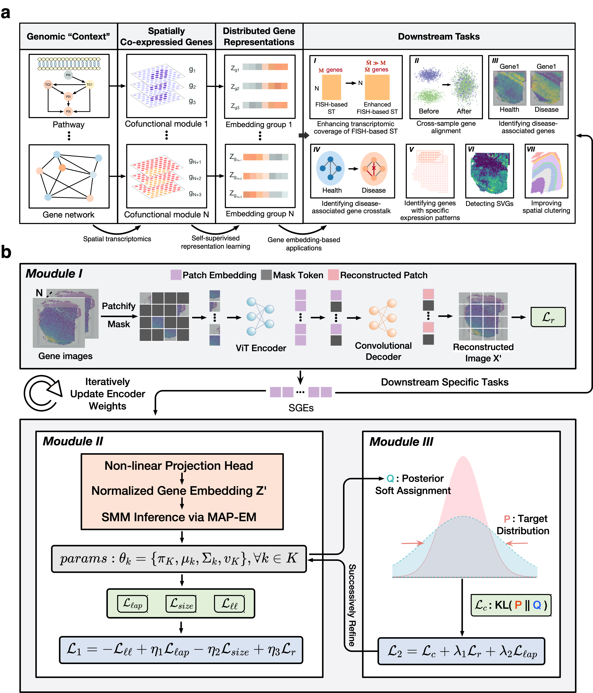

# 0 Welcome to SpaCEX!
We develop the SpaCEX which utilize self-supervised learning on **SPa**tially **C**o-**EX**pressed genes that can simultaneously identify spatially co-expressed genes and learn semantically meaningful gene embeddings from SRT data through a pretext task of gene clustering. SpaCEX first employs an image encoder to transform the spatial expression maps of genes into gene embeddings modeled by a Student’s t mixture distribution (SMM). Subsequently, a discriminatively boosted gene clustering algorithm is applied on the posterior soft assignments of genes to the mixture components, iteratively adapting the parameters of the encoder and the SMM.

<div style="text-align: center;">
    
</div>


## 0.1 Introduction

The limited exploration into spatial gene co-expression within tissues has been a significant bottleneck in fully harnessing the spatial genomic context for more insightful gene representations. To bridge this gap, we introduce **SpaCEX**, a novel few-shot, self-supervised learning model tailored for the genomic field.



As shown in the figure above , **SpaCEX** generates semantically meaningful gene embeddings (SGEs) by identifying spatial gene co-expression patterns. Cofunctional and enrichment analyses of SGEs endorse their utility as genomic contexts, validated through relational semantics and exploration of gene functional ontology. Three novel SGE-based methods are proposed for enhancing FISH-based spatial transcriptomics, detecting spatially variable genes, and spatial clustering. Extensive real data results affirm the superior performance of these methods, highlighting the utility of SGEs for downstream tasks.

# 1 Preparation

## 1.1 Installation

To use SpaCEX, please download code from https://github.com/WLatSunLab/SpaCEX or conduct code below:

```python
git clone https://github.com/WLatSunLab/SpaCEX.git
```

## 1.2 How to get help for SpaCEX

Questions about SpaceX's code or experiments can be asked in the GitHub issue section at https://github.com/WLatSunLab/SpaCEX.

## 1.3 Example Datasets

You can access a variety of datasets for spatial gene expression analysis:

- **Mouse Hippocampus Dataset ([ssq-mHippo](https://singlecell.broadinstitute.org/single_cell/study/SCP815/sensitive-spatial-genome-wide-expression-profiling-at-cellular-resolution#study-summary))**: Available for detailed study.
- **Human Dorsolateral Prefrontal Cortex Datasets ([10x-hDLPFC](http://spatial.libd.org/spatialLIBD))**: Information and datasets are accessible here.
- **Human Breast Cancer Dataset ([10x-hBC](https://support.10xgenomics.com/spatial-gene-expression/datasets/1.1.0/V1_Breast_Cancer_Block_A_Section_1))**: Obtainable for research purposes.
- **Mouse Embryo Dataset based on 10x Visium ([10x-mEmb](https://www.ncbi.nlm.nih.gov/geo/query/acc.cgi?acc=GSE178636))**: Available for comprehensive genetic analysis.
- **Mouse Embryo Dataset based on SeqFISH ([sqf-mEmb](https://crukci.shinyapps.io/SpatialMouseAtlas/))**: Can be accessed for advanced spatial analysis.

Example data required for SpaCEX is available [here](https://drive.google.com/drive/folders/1C3Gk-HVYp2dQh4id8H68M9p8IWEOIut_?usp=drive_link). Please ensure that these data are properly organized as followes:

```
 . <SpaCEX>
        ├── ...
        ├── <data>
        │   ├── 151676_10xvisium.h5ad
        │   ├── DLPFC_matrix_151676.dat
        │   └── <mEmb>
        │       ├── 10x_mEmb_matrix.dat
        │       ├── sqf_mEmb_adata.h5ad
        │       └── qf_mEmb_matrix.dat
        ├── <model_pretrained>
        │   │
        └── ...

```

## 1.4 Quikc start in three specific tasks

Here, example data is preprocessed to demonstrate the application of SpaCEX in three tasks: **Enhancement of the Transcriptomic Coverage in Fish-based ST (ETC)**, **SVG Detection**, and **Spatial Clustering**. In each task, we first remove mitochondrial and External RNA Controls Consortium (ERCC) spike-in genes. Then, genes detected in fewer than 10 spots are excluded. To preserve the spatial data integrity, we do not perform quality control on spatial spots. Finally, the gene expression counts are normalized by library size, followed by log-transformation. 

### 1.4.1 ETC data process

In the data preprocessing step for ETC, it is assumed that the example data is organized as depicted in Section 1.3. Building upon this, one can read the SeqFish data `adata` and perform data preprocessing to yield processed gene names `key_m`, gene expression data in image format `dataset_m`, and gene names for 10x-Visium data `key_v`, along with image format data `dataset_v`.


```python
from SpaCEX.src.SpaCEX_ETC.src.main.SpaCEX_ETC import SpaCEX_ETC
## get data on 10x and sqf
adata = SpaCEX_ETC.get_data(data='sqf', data_type='adata')
adata, key_m, dataset_m = SpaCEX_ETC.data_process(adata)
# key_m, dataset_m = SpaCEX_ETC.get_data(data='sqf', data_type='image')
key_v, dataset_v = SpaCEX_ETC.get_data(data='10x', data_type='image')
```

### 1.4.2 SVG detection data process

In the SVG detection process, the ST data read into `adata` undergoes preprocessing and is then transformed into an image-formatted dataset `dataset`.


```python
## get adata and image data
adata= SpaCEX.get_data(sample_id='151676', data_type='adata')
dataset, adata = SpaCEX.data_process(adata)
```

### 1.4.3 Spatial clustering data process

During the spatial clustering phase, the ST data, once ingested into `adata`, is subject to preprocessing steps before being formatted into an image-based dataset, `dataset``.

```python
## get adata and image data
adata= SpaCEX.get_data(sample_id='151676', data_type='adata')
dataset, adata = SpaCEX.data_process(adata)
```

# 2 Train model to obtain SpaCEX-Generated Embeddings (SGEs) via ST dataset

In this task, we use 10x-visium data adata to generate embeddings SGEs.

## 2.1 Data preprocessing

The original `adata` is processed and converted into an image dataset `dataset`, with the gene names also extracted as `gene_name`
```python
from SpaCEX.src.main.SpaCEX import SpaCEX
from sklearn.preprocessing import MinMaxScaler
from scipy.cluster import hierarchy
import seaborn as sns
import matplotlib.pyplot as plt
import warnings
warnings.filterwarnings("ignore")
```

```python
## get adata and image data
adata= SpaCEX.get_data(sample_id='151676', data_type='adata')
dataset, adata = SpaCEX.data_process(adata)
gene_name = adata.var.index.values
```

In this 

